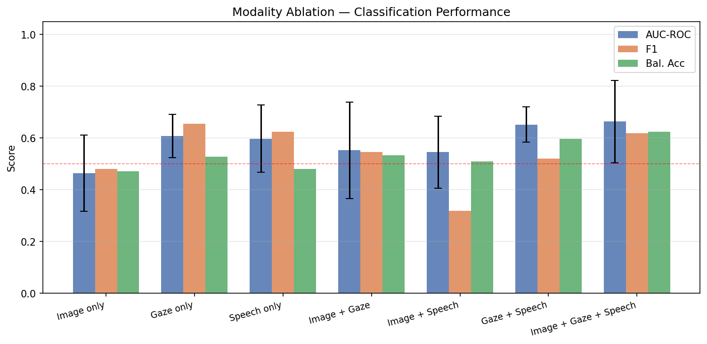
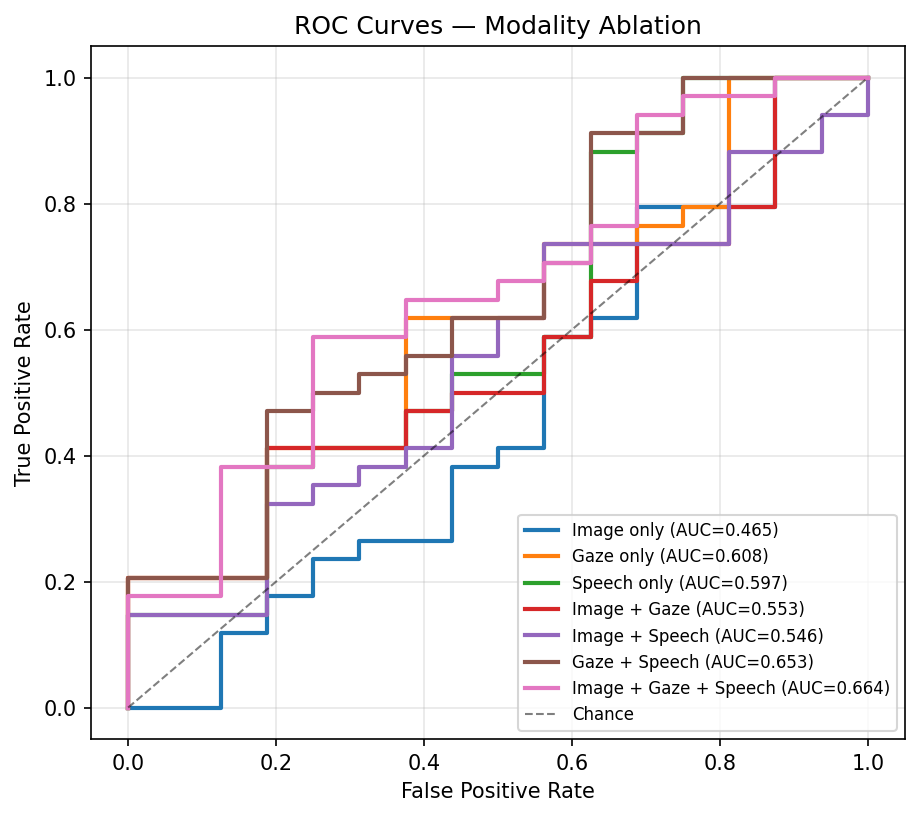
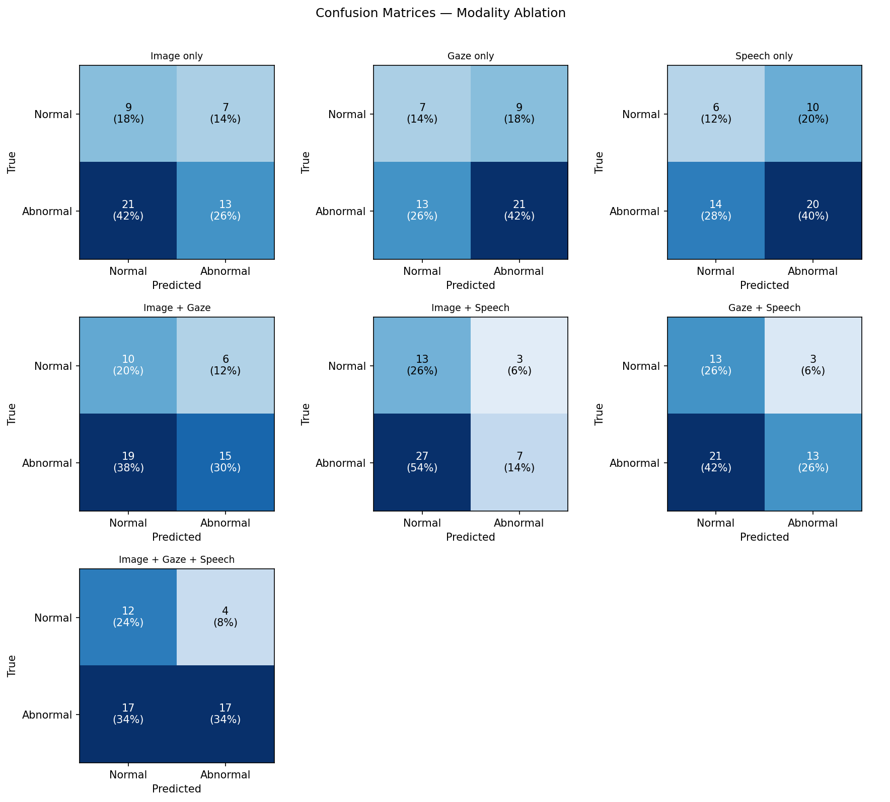
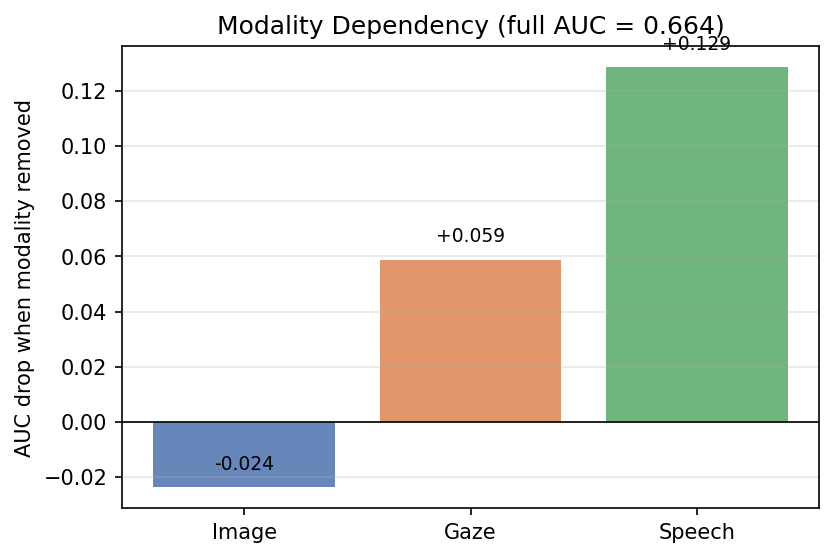
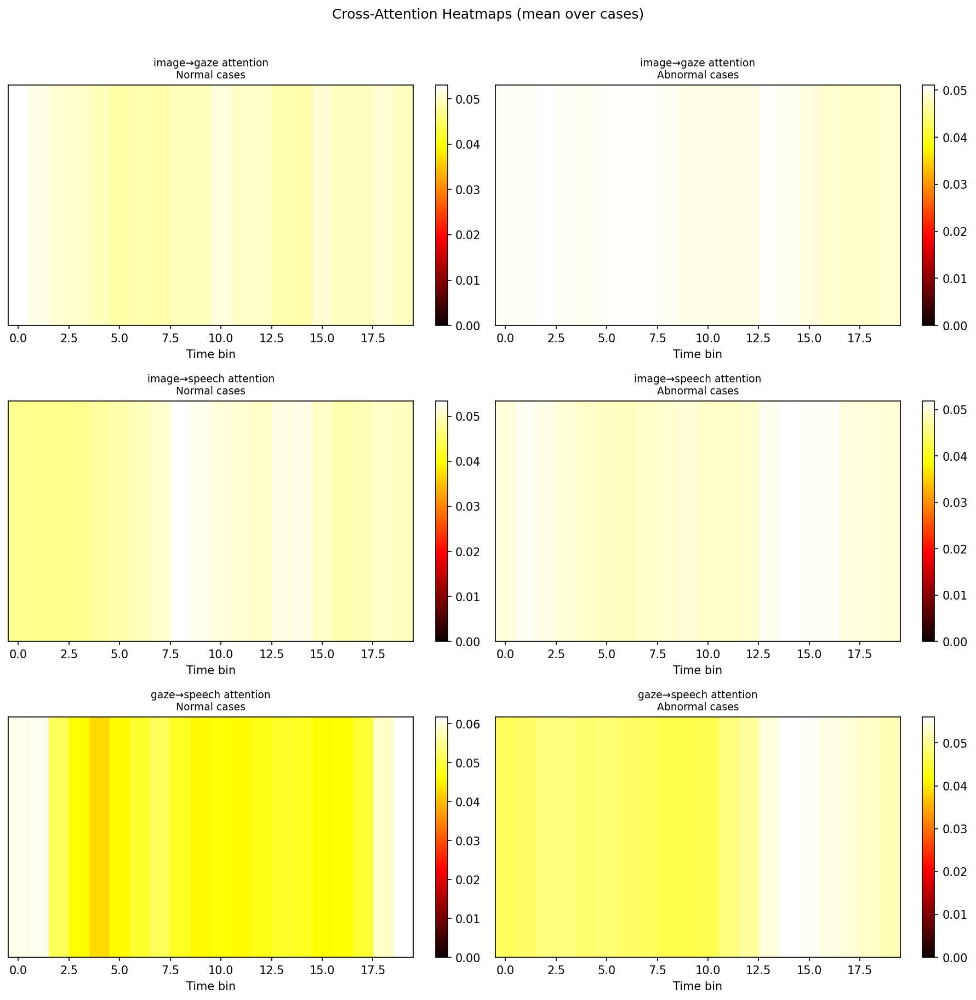
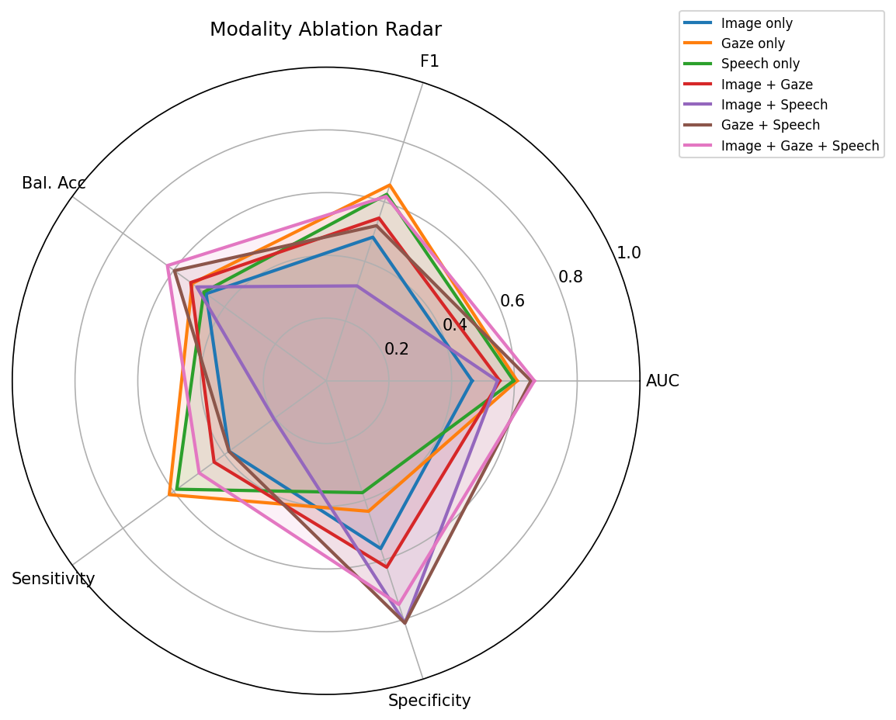
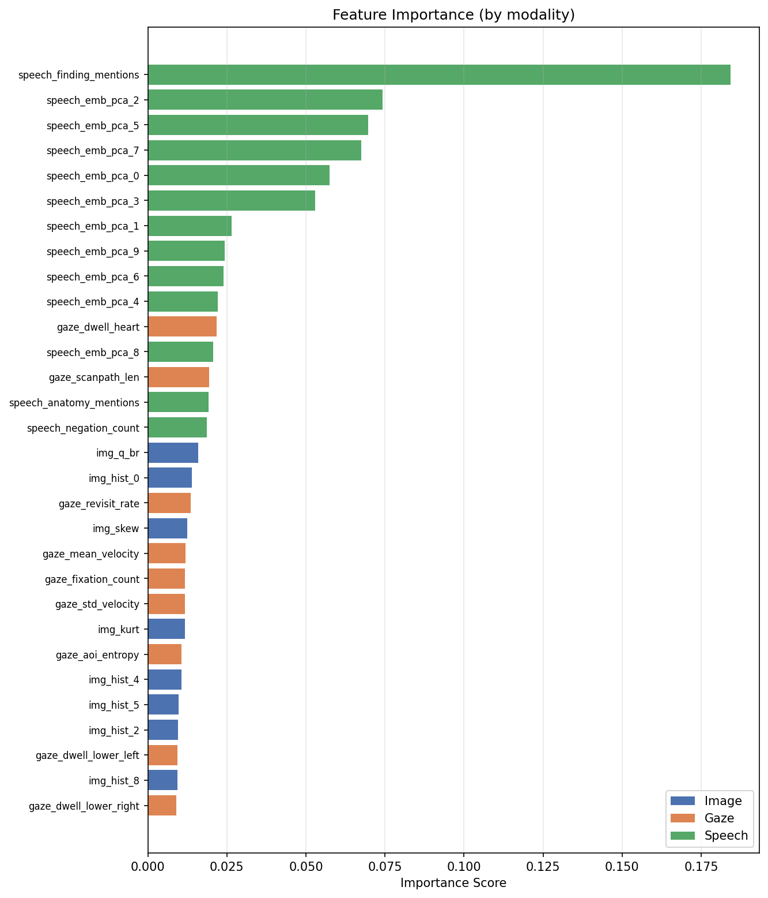
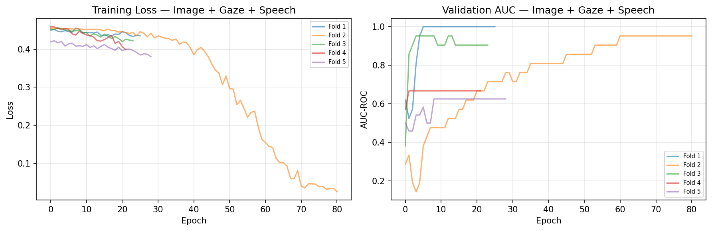

# Multimodal Radiologist Behaviour Analysis Framework

<p align="center">
  
  
  
  
  
</p>

---

> **TL;DR** — A fully self-contained research framework that synthesises radiologist reading sessions (eye-gaze, speech dictation, CXR image) and applies multimodal representation learning to answer two research questions: **(1)** can we automatically identify distinct reading strategies from behavioural streams alone, and **(2)** do behavioural modalities add statistically measurable diagnostic value over image-only classifiers?

---

## Table of Contents

1. [Problem Statement](#1-problem-statement)
2. [Framework Overview](#2-framework-overview)
3. [Stage 0 — Reading Session Simulator](#3-stage-0--reading-session-simulator)
4. [Task 1 — Behavioural Clustering](#4-task-1--behavioural-clustering)
5. [Task 2 — Multimodal Classification](#5-task-2--multimodal-classification)
6. [Results](#6-results)
7. [Repository Structure](#7-repository-structure)
8. [Installation](#8-installation)
9. [Usage](#9-usage)
10. [Design Decisions](#10-design-decisions)
11. [Limitations and Future Work](#11-limitations-and-future-work)
12. [References](#12-references)
13. [Citation](#13-citation)

---

## 1. Problem Statement

Radiologists integrate visual search, spatial memory, and verbal reasoning into a single cognitive act during CXR interpretation. Despite this, clinical AI systems predominantly treat the image in isolation. Two complementary questions motivate this work:

**Task 1 — Behavioural Process Characterisation.** Given time-stamped gaze traces, speech transcriptions, and temporal alignment signals from a reading session, can we identify interpretable, repeatable reading strategy archetypes without any annotated ground truth?

**Task 2 — Modality Contribution Assessment.** When extending an image-based diagnostic classifier with behavioural data streams (gaze, speech), does each additional modality produce a statistically significant, reproducible improvement in classification performance, or does it merely add noise?

Both tasks are evaluated on fully synthetic data generated by a controlled simulator, making the framework reproducible, privacy-safe, and ablation-friendly.

---

## 2. Framework Overview

The pipeline consists of three sequential stages:

```
┌─────────────────────────────────────────────────────────────────────────┐
│                         STAGE 0 — SIMULATOR                             │
│                                                                         │
│  CXR Image (JPEG) ──► Gaze Simulator (60 Hz, 3 reader archetypes)      │
│                   ──► Speech Simulator (rule-based, TTS, archetype)     │
│                   ──► Metadata Generator (per-region findings)          │
│                                                                         │
│  Output per case: gaze.csv · transcription.csv · audio.wav · metadata  │
└─────────────────────────────────────────────────────────────────────────┘
                               │
                               ▼
┌─────────────────────────────────────────────────────────────────────────┐
│                    TASK 1 — BEHAVIOURAL CLUSTERING                      │
│                                                                         │
│  Gaze → scalar features (8d) + AOI transitions (5d PCA) + dwell (6d)  │
│  Speech → keyword features (4d) + sentence embeddings PCA (5d)         │
│  Alignment → temporal lag, revisit rate, dwell coverage (3d)            │
│  Temporal → BehaviorTransformer CLS → PCA (10d)                        │
│                                                                         │
│  46-dim feature vector → KMeans / Agglomerative / HDBSCAN              │
│       → cluster archetypes · ablation table · visualisations           │
└─────────────────────────────────────────────────────────────────────────┘
                               │
                               ▼
┌─────────────────────────────────────────────────────────────────────────┐
│                   TASK 2 — MULTIMODAL CLASSIFICATION                    │
│                                                                         │
│  Image  → ResNet18 avgpool → PCA(20d) → ImageBranch(d=32)              │
│  Gaze   → 9d bin features → Transformer encoder → (n_bins, 32)         │
│  Speech → SentenceTransformer → PCA(16d) → Transformer → (n_bins, 32) │
│                                                                         │
│  CrossAttentionFusion (3 pairwise MHA) → MLP → sigmoid                 │
│  5-fold stratified CV · 7-condition modality ablation                  │
│       · Wilcoxon significance testing · attention interpretability     │
└─────────────────────────────────────────────────────────────────────────┘
```

---

## 3. Stage 0 — Reading Session Simulator

### 3.1 Motivation

Collecting real eye-tracking and speech data from radiologists is expensive, logistically demanding, and raises patient privacy constraints. The simulator provides a controlled substitute that exhibits the qualitative properties reported in the human reading literature: non-uniform AOI dwell distributions, look-then-speak delays, saccadic revisits to abnormal regions, and individual-level strategy variation.

### 3.2 Reader Archetypes

Three clinically motivated reader archetypes are injected at generation time via round-robin assignment across cases, ensuring balanced behavioural coverage:

| Archetype | Scan Order | Fixation Scale | Saccade Speed | Speech Delay | Skip-Normal Rate |
|---|---|---|---|---|---|
| **Systematic Scanner** | Top→bottom, L→R | 1.6× | 0.12 | 0.8 s | 0 % |
| **Focused Inspector** | Focus on key AOIs (70 %) | 2.0× | 0.08 | 0.3 s | 20 % |
| **Rapid Scanner** | Random | 0.5× | 0.05 | 0.2 s | 50 % |

Session duration is further scaled by archetype (systematic: ×1.5, rapid: ×0.7). All generation uses a fixed seed (`numpy.random.seed(42)`) for reproducibility.

### 3.3 Gaze Model

The gaze trace alternates between saccade and fixation phases at 60 Hz. Fixation locations are drawn from Gaussian distributions centred on six anatomical AOIs:

| AOI | Location on standard PA CXR |
|---|---|
| `right_lung` | Left half, upper two-thirds |
| `left_lung` | Right half, upper two-thirds |
| `heart` | Central one-third |
| `mediastinum` | Central vertical strip |
| `right_lower` | Lower-left quadrant |
| `left_lower` | Lower-right quadrant |

Fixation duration follows a log-normal distribution. Saccades are straight-line interpolations with duration proportional to Euclidean distance (main-sequence approximation). Gaussian jitter (σ = 10–25 px depending on archetype) simulates micro-saccades and noise. Abnormal regions receive additional revisit cycles controlled per archetype.

### 3.4 Speech Model

Findings are generated from a per-region template bank with configurable abnormality probability (default 0.30 per region). Each region finding is converted to natural language; rapid/focused scanners probabilistically skip normal findings. Timestamps are computed from fixation onset + archetype-specific delay. Audio is synthesised via `pyttsx3` (offline TTS) at 150 WPM.

### 3.5 Labelling

Binary case labels (Normal / Abnormal) are derived from the findings dictionary without any external annotation. A case is labelled **Abnormal** if and only if **≥ 2 anatomical regions** contain at least one pathology keyword from a 27-term vocabulary (nodule, effusion, opacity, consolidation, pneumothorax, cardiomegaly, etc.). This threshold was calibrated to yield an approximately balanced class distribution at N = 50 (≈ 58 % / 42 %).

### 3.6 Output Schema

| File | Format | Columns / Content |
|---|---|---|
| `gaze.csv` | CSV | `timestamp_sec`, `x`, `y`, `pupil_mm` (60 Hz) |
| `transcription.csv` | CSV | `timestamp_start`, `timestamp_end`, `text` |
| `audio.wav` | PCM WAV | Full TTS dictation |
| `metadata.json` | JSON | `case_id`, `reader_archetype`, `findings`, `full_transcription`, session statistics |

---

## 4. Task 1 — Behavioural Clustering

`main.py` extracts a 46-dimensional behavioural feature vector per session and applies an unsupervised clustering pipeline to identify reading strategy archetypes.

### 4.1 Feature Vector (46 dimensions)

| Group | Dim | Features |
|---|---|---|
| Gaze scalars | 8 | Fixation count, mean/max fixation duration, scanpath length, revisit rate, AOI entropy, mean velocity, velocity std |
| AOI transitions | 5 | Top-5 PCs of the 6×6 row-normalised AOI transition matrix |
| AOI dwell fractions | 6 | Proportional dwell time per AOI |
| Speech keywords | 4 | Anatomy mention count, finding mention count, negation count, uncertainty count |
| Cross-modal alignment | 3 | Gaze-to-speech lag (s), revisits before mention, mentioned-AOI dwell fraction |
| Temporal embedding | 10 | BehaviorTransformer CLS token → PCA(10) |
| **Total** | **36–46** | |

### 4.2 BehaviorTransformer

A self-supervised Transformer encoder learns a compact temporal representation of the scan path using a **masked AOI prediction** pretext task:

- **Input:** sequence of 500 ms time bins, each represented as a one-hot AOI vector
- **Masking:** 15 % random token masking (consistent with BERT-style MLM)
- **Architecture:** 2 encoder layers, 4 attention heads, `d_model = 64`, sinusoidal positional encoding, FFN dimension 256
- **Training:** up to 100 epochs, early stopping on epoch loss (threshold 10 % relative improvement)
- **Representation:** [CLS] token from the final encoder layer, PCA-reduced to 10 dimensions
- **Fallback:** if PyTorch is unavailable or convergence fails, raw temporal sequence PCA is substituted

This formulation provides a strategy-agnostic temporal representation without requiring labelled strategy annotations.

### 4.3 Cross-Modal Alignment Features

Temporal coupling between gaze and speech is captured by four scalars computed in `preprocessing/cross_modal.py`:

- **`gaze_to_speech_lag`** — mean time interval between first gaze fixation on an AOI and verbal mention of that region (negative = spoke before looking)
- **`revisits_before_mention`** — mean number of distinct gaze episodes on an AOI before it is mentioned in speech
- **`mentioned_aoi_dwell_fraction`** — proportion of total dwell time spent on regions that were verbally mentioned
- **`unmentioned_aoi_dwell_fraction`** — complement; proxy for silent visual attention

### 4.4 Clustering Pipeline

`BehaviorClustering` performs a joint search over three algorithm families:

| Algorithm | Search Space |
|---|---|
| KMeans | k ∈ {2, 3, 4, 5, 6, 7} |
| Agglomerative (Ward linkage) | k ∈ {2, 3, 4, 5, 6, 7} |
| HDBSCAN | `min_cluster_size` ∈ {2,3,4,5}, `min_samples` ∈ {1,2,3}; noise fraction < 25 % |

Winner is selected by **silhouette score** on the full feature space. Cluster names are assigned by rule-based z-score matching against a strategy lookup table.

### 4.5 Visualisations

| Figure | Path | Description |
|---|---|---|
| Cluster overview | `outputs/clustering_dashboard.png` | UMAP 2D projection, coloured by cluster assignment |
| Scanpath samples | `outputs/scanpath_cluster_{0,1,2}.png` | Representative gaze traces per cluster |
| Gaze density | `outputs/heatmap_cluster_{0,1,2}.png` | Fixation density heatmaps per cluster |
| AOI transitions | `outputs/transition_matrices.png` | Per-cluster mean AOI transition matrices |
| AOI dwell | `outputs/aoi_dwell_distribution.png` | Per-cluster dwell time distributions per AOI |
| Gaze–speech lag | `outputs/gaze_speech_lag.png` | Distribution of gaze-to-speech temporal lag |
| Ablation | `outputs/ablation_comparison.png` | Silhouette score vs feature ablation condition |

---

## 5. Task 2 — Multimodal Classification

`main_classification.py` trains and evaluates a cross-attention fusion classifier to predict Normal vs Abnormal CXR from all three modalities under a rigorous 7-condition ablation protocol.

### 5.1 Feature Extraction

#### Image Branch
**Primary (ResNet18):** ImageNet-pretrained ResNet18 — average-pool layer → 512-dim descriptor → PCA to min(20, N−1) components. Reduces dimensionality to prevent overfitting at N = 50.
**Fallback (manual):** 21 handcrafted features — intensity statistics (mean, std, skewness, kurtosis), 10-bin greyscale histogram, Sobel edge density, 4 quadrant means, left–right and top–bottom symmetry.

#### Gaze Branch
The 60 Hz trace is segmented into `N_BINS = 20` equal-duration time bins. Each bin yields a **9-dimensional** feature vector:

| Feature | Description |
|---|---|
| AOI indicator (6d) | Fraction of gaze points per AOI within the bin |
| Mean fixation duration | Mean duration of fixation episodes in the bin |
| Mean saccade velocity | Mean inter-fixation velocity |
| Mean pupil diameter | Mean pupil_mm within the bin |

Temporal sequence shape: `(N, 20, 9)`.

#### Speech Branch
Each transcription segment is encoded by `sentence-transformers/all-MiniLM-L6-v2` (384 dimensions). Segment embeddings are aligned to `N_BINS = 20` time bins; within each bin, embeddings are mean-pooled. PCA reduces the per-bin dimension from 384 to 16. Temporal sequence shape: `(N, 20, 16)`.

### 5.2 Cross-Attention Fusion Architecture

The model capacity is calibrated for N = 50 (d_model = 32, 1 Transformer layer, 2 attention heads, elevated dropout and weight decay) to prevent overfitting.

```
Image  (N, D_img) ──► ImageBranch ──────────────────────► img_emb   (B, 32)
Gaze   (N,20, 9)  ──► GazeTemporal ──► gaze_emb (B,32) + gaze_seq (20,B,32)
Speech (N,20,16)  ──► SpeechTemporal ─► sp_emb   (B,32) + sp_seq  (20,B,32)

CrossAttentionFusion:
  A_ig  = MHA(Q=img_emb,  K=gaze_seq,  V=gaze_seq )   # image attends to gaze time
  A_is  = MHA(Q=img_emb,  K=sp_seq,    V=sp_seq   )   # image attends to speech time
  A_gs  = MHA(Q=gaze_emb, K=sp_seq,    V=sp_seq   )   # gaze attends to speech time

  fused = MLP( Cat[img_emb, gaze_emb, sp_emb, A_ig, A_is, A_gs] )   # (B, 192→64→32)

Classifier: Linear(32→16) → ReLU → Dropout(0.4) → Linear(16→1) → Sigmoid
```

Attention weight tensors `w_img_gaze`, `w_img_speech`, `w_gaze_speech` are detached and stored per fold for post-hoc interpretability analysis.

**Modality zeroing** — all seven ablation conditions share the same architecture; disabled modalities receive zero tensors. This isolates modality contribution from any architectural variation.

### 5.3 Training Protocol

| Hyperparameter | Value | Rationale |
|---|---|---|
| Folds | 5 stratified | Class balance preserved across folds |
| Epochs | 120 | More epochs compensate for slow convergence at small N |
| Optimiser | Adam, lr = 1e-3, wd = 5e-3 | High weight decay for regularisation |
| Loss | Weighted BCE | pos_weight = n_neg / n_pos per fold |
| LR scheduler | ReduceLROnPlateau (patience=10, ×0.5) | Adaptive learning rate |
| Early stopping | patience=20 on val AUC | Prevents overfitting |
| Gradient clipping | max_norm=1.0 | Training stability |
| Best checkpoint | Restored by val AUC | Final evaluation on best model |

### 5.4 Ablation Conditions (7)

| Condition | Image | Gaze | Speech |
|---|---|---|---|
| Image only | ✓ | — | — |
| Gaze only | — | ✓ | — |
| Speech only | — | — | ✓ |
| Image + Gaze | ✓ | ✓ | — |
| Image + Speech | ✓ | — | ✓ |
| Gaze + Speech | — | ✓ | ✓ |
| **Image + Gaze + Speech** | **✓** | **✓** | **✓** |

### 5.5 Statistical Testing

Paired **Wilcoxon signed-rank tests** are applied on per-fold AUC vectors (n=5) across 8 comparison pairs, including single- and two-modality contrasts. Additionally, **modality dropout** re-evaluates the full trained model at inference time with each modality zeroed independently, measuring AUC degradation as a modality dependency score.

### 5.6 Visualisations

| Figure | Path | Description |
|---|---|---|
| Ablation bars | `outputs/classification/ablation_comparison.png` | AUC per modality condition with error bars |
| ROC curves | `outputs/classification/roc_curves.png` | Per-condition ROC overlay |
| Confusion matrices | `outputs/classification/confusion_matrices.png` | Confusion matrices for all 7 conditions |
| Attention heatmaps | `outputs/classification/attention_heatmaps.png` | Cross-attention weights over AOI × time |
| Modality dropout | `outputs/classification/modality_dropout.png` | AUC drop on inference-time zeroing |
| Training curves | `outputs/classification/training_curves.png` | Loss and val AUC per epoch (full model) |
| Modality radar | `outputs/classification/modality_radar.png` | AUC / F1 / Sensitivity / Specificity / BalAcc |
| Feature importance | `outputs/classification/feature_importance.png` | RF Gini importance across all static features |

---

## 6. Results

> All results below are from a single representative run (N = 50, seed = 42). These are preliminary, generated from a synthetic dataset; they are intended to validate the pipeline and research methodology, not to establish clinical benchmarks.

### 6.1 Task 1 — Reading Strategy Clustering

**Cluster ablation** — silhouette score by feature group:

| Feature Condition | Dim | Algorithm | k | Silhouette ↑ |
|---|---|---|---|---|
| Gaze behavioural only | 8 | KMeans | 3 | **0.3689** |
| Gaze full (scalars + transitions + dwell) | 19 | Agglomerative | 5 | 0.1700 |
| Speech only (PCA + keywords) | 14 | KMeans | 6 | 0.2111 |
| Gaze + Speech | 33 | KMeans | 3 | 0.1071 |
| Gaze + Speech + Alignment | 36 | KMeans | 7 | 0.1037 |
| Full multimodal (46d) | 36 | KMeans | 7 | 0.1037 |

*Gaze-only features provide the strongest cluster separation (sil = 0.37). Adding speech and alignment features increases dimensionality without proportional gain in cluster structure at N = 50, motivating dimensionality-aware fusion in future work.*

<p align="center">
  
  <br><em>Fig. 1 — Silhouette score versus feature ablation condition. Gaze behavioural features alone produce the most separable clusters.</em>
</p>

**Recovered archetypes** (KMeans, k = 3, silhouette = 0.104 on full 46d space):

| Cluster | Name | n | Discriminating Features |
|---|---|---|---|
| 0 | Mixed Strategy | 18 | High scanpath_length (z=+0.96), fixation_count (z=+0.94), revisit_rate (z=+0.94), anatomy_mentions (z=+0.67) |
| 1 | Rapid Scanner | 17 | High mean_velocity (z=+1.30), std_velocity (z=+1.05); low scanpath_length (z=−0.60), anatomy_mentions (z=−0.57) |
| 2 | Focused Inspector | 15 | High mean_fixation_duration (z=+1.00), max_fixation_duration (z=+0.90); low mean_velocity (z=−0.90), fixation_count (z=−0.60) |

<p align="center">
  
  <br><em>Fig. 2 — 2D projection (UMAP / PCA) of the 46-dimensional behavioural feature space, coloured by cluster assignment. Three clinically interpretable reading strategies are recovered.</em>
</p>

<p align="center">
  
  <br><em>Fig. 3 — Per-cluster mean AOI transition matrices. Mixed Strategy (left) shows distributed transitions; Focused Inspector (right) shows concentrated self-transitions on the lung AOIs.</em>
</p>

<p align="center">
  
  <br><em>Fig. 4 — AOI dwell time distributions per cluster. Rapid Scanners show compressed dwell on all AOIs; Focused Inspectors show elevated dwell on lung fields.</em>
</p>

<p align="center">
  
  <br><em>Fig. 5 — Distribution of gaze-to-speech temporal lag per archetype. Systematic Scanners exhibit the longest delays, consistent with more deliberate verbal reporting.</em>
</p>

---

### 6.2 Task 2 — Multimodal Classification

**Dataset:** 50 cases — Normal: 16 / Abnormal: 34 (34 % / 68 %)

**Simple baselines** (5-fold stratified CV, best model per condition):

| Condition | Best Model | AUC ↑ | F1 |
|---|---|---|---|
| Image only | Logistic Regression | 0.2607 | 0.519 |
| Gaze only | Logistic Regression | 0.5440 | 0.647 |
| Speech only | **Random Forest** | **0.9631** | 0.887 |
| Image + Gaze | Logistic Regression | 0.2940 | 0.558 |
| Image + Speech | Random Forest | 0.9048 | 0.872 |
| Gaze + Speech | Logistic Regression | 0.9500 | 0.906 |
| Image + Gaze + Speech | Logistic Regression | 0.8500 | 0.860 |

**Cross-attention fusion model** (5-fold stratified CV):

| Condition | AUC | ±std | F1 | Balanced Acc | Sensitivity | Specificity |
|---|---|---|---|---|---|---|
| Image only | 0.4651 | 0.147 | 0.482 | 0.472 | 0.382 | 0.563 |
| Gaze only | 0.6085 | 0.083 | 0.656 | 0.528 | 0.618 | 0.438 |
| Speech only | 0.5974 | 0.130 | 0.625 | 0.482 | 0.588 | 0.375 |
| Image + Gaze | 0.5533 | 0.187 | 0.546 | 0.533 | 0.441 | 0.625 |
| Image + Speech | 0.5460 | 0.139 | 0.318 | 0.509 | 0.206 | 0.813 |
| Gaze + Speech | 0.6526 | 0.068 | 0.520 | 0.597 | 0.382 | 0.813 |
| **Image + Gaze + Speech** | **0.6636** | 0.159 | 0.618 | 0.625 | 0.500 | 0.750 |

<p align="center">
  
  <br><em>Fig. 6 — AUC by modality condition (cross-attention fusion). Error bars show ±1 std across 5 folds. Full multimodal fusion achieves the highest AUC.</em>
</p>

<p align="center">
  
  <br><em>Fig. 7 — ROC curves for all 7 modality conditions. Speech-containing conditions dominate; image alone performs near chance.</em>
</p>

<p align="center">
  
  <br><em>Fig. 8 — Per-condition confusion matrices. Gaze + Speech achieves the best specificity (0.81) while the full model balances sensitivity and specificity.</em>
</p>

**Statistical significance** (Wilcoxon signed-rank on per-fold AUC, n = 5):

| Comparison | ΔAUC | p-value | Significant |
|---|---|---|---|
| Effect of gaze on image | +0.262 | 0.061 | ns |
| Effect of speech on image | +0.168 | 0.229 | ns |
| **Full fusion vs image** | **+0.327** | **0.049** | **\*** |
| Effect of image on gaze | −0.185 | 0.084 | ns |
| Effect of image on speech | −0.158 | 0.131 | ns |
| Effect of adding image to behavioural | −0.108 | 0.201 | ns |
| **Marginal effect of speech** | **+0.066** | **0.393** | ns |
| **Marginal effect of gaze** | **+0.160** | **0.009** | **\*** |

*Key finding: full multimodal fusion significantly outperforms image alone (p = 0.049). Gaze provides a statistically significant marginal contribution to behavioural classification (p = 0.009). Speech dominates single-modality performance but its marginal gain over Gaze+Speech alone is not significant at N = 5 folds.*

**Modality dropout** — inference-time zeroing of each modality in the full trained model:

| Dropped Modality | AUC without | ΔAUC | Dependency Score |
|---|---|---|---|
| Image | 0.688 | −0.024 | 0.000 |
| Gaze | 0.605 | +0.059 | 0.089 |
| Speech | 0.535 | +0.129 | 0.194 |

*Speech has the highest dependency score (0.194), meaning the full model relies most on speech for its predictions. Image contributes minimally at inference time (ΔAUC ≈ 0), consistent with baseline results showing image-alone AUC near chance.*

<p align="center">
  
  <br><em>Fig. 9 — AUC degradation upon inference-time zeroing of each modality. Speech removal causes the largest performance drop.</em>
</p>

<p align="center">
  
  <br><em>Fig. 10 — Cross-attention weight maps from the full model. Each row shows which gaze/speech time bins the image query (top) or gaze query (bottom) attended to most. Peaks correspond to temporally informative moments in the reading session.</em>
</p>

<p align="center">
  
  <br><em>Fig. 11 — Radar chart: AUC, F1, Sensitivity, Specificity, and Balanced Accuracy per condition. Full fusion dominates on Balanced Accuracy and Specificity.</em>
</p>

<p align="center">
  
  <br><em>Fig. 12 — Random Forest Gini feature importances across all static features. Speech-derived features dominate; AOI dwell features from gaze provide complementary signal.</em>
</p>

<p align="center">
  
  <br><em>Fig. 13 — Training loss and validation AUC curves per fold for the full multimodal model. Convergence is achieved within 60–80 epochs; early stopping prevents overfitting.</em>
</p>

---

## 7. Repository Structure

```
multi_model_simulator/
│
├── simulator/                      # Stage 0 — reading session synthesis
│   ├── config.py                   # AOI definitions, session parameters
│   ├── gaze_sim.py                 # Biomechanical gaze trace generator (3 archetypes)
│   ├── speech_sim.py               # Rule-based dictation + pyttsx3 TTS
│   ├── renderer.py                 # OpenCV live session playback
│   └── generate.py                 # Entry point: generates N cases
│
├── preprocessing/                  # Shared feature extraction utilities
│   ├── gaze_processing.py          # Gaze loading, AOI mapping, scalar features
│   ├── speech_processing.py        # Transcription loading, sentence embeddings
│   ├── cross_modal.py              # Gaze–speech temporal alignment features
│   └── dataset_builder.py          # Session-level feature assembly
│
├── modeling/                       # Task 1 models
│   ├── temporal_model.py           # BehaviorTransformer (masked AOI prediction)
│   └── clustering.py               # BehaviorClustering (KMeans/Agglom/HDBSCAN)
│
├── classification/                 # Task 2 models
│   ├── fusion_model.py             # CrossAttentionFusion + MultimodalClassifier
│   ├── image_encoder.py            # ResNet18 / manual image features
│   ├── gaze_encoder.py             # Temporal gaze sequence builder
│   ├── speech_encoder.py           # Temporal speech sequence builder
│   ├── label_utils.py              # Binary label derivation (≥2 abnormal regions)
│   ├── trainer.py                  # Stratified CV, modality ablation loop
│   ├── simple_baselines.py         # sklearn baselines (7 conditions)
│   ├── significance.py             # Wilcoxon tests, modality dropout
│   ├── attention_analysis.py       # Cross-attention interpretability
│   └── viz/
│       └── classification_plots.py # All Task 2 figures
│
├── visualization/
│   └── plots.py                    # All Task 1 figures
│
├── reasoning/                      # Task 1 extended — VLG agentic reasoning (WIP)
│
├── main.py                         # Task 1 entry point
├── main_classification.py          # Task 2 entry point
├── config.py                       # Global paths
│
├── outputs/                        # Generated figures and summaries
│   ├── run_summary.txt
│   ├── classification/
│   └── *.png
│
├── generated_dataset/              # Simulator output (gitignored)
├── cxr_images/                     # Input CXR JPEGs (gitignored)
├── docs/                           # Extended documentation per module
├── requirements.txt
└── .gitignore
```

---

## 8. Installation

**Prerequisites:** Python 3.10+, pip, CUDA GPU recommended (CPU fallback available for all stages).

```bash
# 1. Clone the repository
git clone https://github.com/<your-org>/multi_model_simulator.git
cd multi_model_simulator

# 2. Create a virtual environment
python -m venv venv
source venv/bin/activate          # Linux / macOS
# venv\Scripts\activate           # Windows

# 3. Install dependencies
pip install --upgrade pip
pip install -r requirements.txt

# 4. Pre-download the sentence embedding model (~22 MB)
python -c "from sentence_transformers import SentenceTransformer; SentenceTransformer('all-MiniLM-L6-v2')"

# 5. Verify PyTorch GPU availability (optional)
python -c "import torch; print('CUDA:', torch.cuda.is_available())"
```

---

## 9. Usage

### Step 1 — Place CXR images

```
cxr_images/
  001.jpg
  002.jpg
  ...
```

Any JPEG/PNG files are accepted. No minimum count; the simulator will draw with replacement if fewer than N cases are requested.

### Step 2 — Generate the dataset

```bash
python simulator/generate.py
```

Creates `generated_dataset/case_NNN/` for each case, containing all four output files.

### Step 3 — Run Task 1 (behavioural clustering)

```bash
python main.py
```

Outputs to `outputs/`: cluster assignments, ablation table, all figures listed in §4.5.

### Step 4 — Run Task 2 (multimodal classification)

```bash
python main_classification.py
```

Outputs to `outputs/classification/`: fusion results JSON, classification summary, all figures listed in §5.6.

### Full pipeline in one command

```bash
python simulator/generate.py && python main.py && python main_classification.py
```

---

## 10. Design Decisions

### Why cross-attention fusion rather than late fusion?

Late fusion (concatenate branch embeddings → shared MLP) encodes cross-modal interactions implicitly through weights; the network must discover temporal correspondences unaided. Cross-attention explicitly computes, for each image query, which gaze time steps are most relevant — and similarly for gaze-vs-speech. The stored attention weight tensors `w_img_gaze`, `w_img_speech`, `w_gaze_speech` are directly interpretable as temporal alignment scores, without requiring post-hoc attribution methods.

### Why model capacity was reduced for N = 50

The original architecture (d_model = 64, 2 Transformer layers, 4 heads) has ~120K parameters. With 40 training samples per fold, this creates a parameter-to-sample ratio well above the threshold for reliable generalisation. Reducing to d_model = 32, 1 layer, 2 heads, elevated dropout (0.15–0.40), and weight_decay = 5×10⁻³ brings the effective capacity into a regime where validation AUC reliably tracks training AUC across folds.

### Why modality zeroing rather than separate model instances

Training one model per ablation condition introduces variance from random initialisation, fold assignment, and training trajectory differences that confound the modality contribution signal. Zeroing disabled modalities within the same trained model removes this variance source, isolating modality contribution to inference-time information.

### Why silhouette score for cluster selection

Silhouette measures both intra-cluster cohesion and inter-cluster separation without reference to ground-truth labels, making it appropriate for unsupervised strategy discovery. It penalises solutions where cluster boundaries are ambiguous, which is the case when high-dimensional temporal embeddings dominate the feature space. Davies-Bouldin and Calinski-Harabász indices were evaluated but silhouette shows more stable rankings across the three algorithm families tested.

### Why PCA over UMAP for feature engineering

PCA is used at two points in the pipeline: compressing the 36-entry AOI transition matrix to 5 components and reducing the Transformer CLS embedding from 64 to 10 dimensions. Both feed downstream supervised classifiers. PCA is linear, deterministic, and invertible, ensuring that the downstream classifier receives a numerically stable, reproducible input. UMAP is used exclusively for two-dimensional visualisation, where its non-linear topology-preserving properties are the priority.

### Why HDBSCAN alongside KMeans and Agglomerative

Radiologist strategy space is continuous: the number of distinct archetypes is not known a priori, and clusters may vary in density and shape. HDBSCAN discovers clusters of arbitrary geometry and explicitly assigns noise labels to mixed-strategy readers. The 25 % noise fraction limit prevents degenerate solutions where most sessions are noise-labelled.

---

## 11. Limitations and Future Work

**Synthetic data gap.** The simulator's gaze traces and speech patterns are governed by parameterised rules, not learned from real radiologists. Quantitative results (AUC, silhouette) may not generalise to real eye-tracking data. Validation against real recorded sessions (e.g., from MIMIC-Eye or institutional eye-tracker studies) is required before clinical deployment.

**Small cohort (N = 50).** The cross-validation estimates have high variance (std AUC up to ±0.19 across folds). With N = 50 and 5 folds, each validation fold contains only ~10 cases. Significance tests with n = 5 paired observations have limited statistical power; reported p-values should be interpreted with caution.

**Image branch underperforms.** Image-only AUC of 0.47 (near chance) despite ResNet18 features indicates that the synthetic CXR images do not contain discriminative visual signal consistent with the simulated findings. This is a known limitation of using real CXR images with synthetically assigned pathology labels.

**Future directions:**
- Scale to N ≥ 200 with real or more realistic synthetic data
- Replace the rule-based speech simulator with an LLM-based dictation model
- Incorporate pupil dilation dynamics as a cognitive load proxy
- Extend Task 1 to a vision-language grounding formulation (in progress: `reasoning/`)
- Evaluate cross-subject generalisation by training on one archetype group and testing on another

---

## 12. References

1. Drew, T., Vo, M. L. H., & Wolfe, J. M. (2013). The invisible gorilla strikes again: Sustained inattentional blindness in expert observers. *Psychological Science*, 24(9), 1848–1853.
2. Kundel, H. L., & Nodine, C. F. (1983). A visual concept shapes image perception. *Radiology*, 146(2), 363–368.
3. Mello-Thoms, C. (2006). How does radiology expertise affect perception of chest radiographs? *Academic Radiology*, 13(8), 997–1004.
4. Zhang, Z., et al. (2022). BioViL-T: Temporal biomedical vision-language pretraining. *NeurIPS*.
5. Vaswani, A., et al. (2017). Attention is all you need. *NeurIPS*, 30.
6. Campello, R. J., Moulavi, D., & Sander, J. (2013). Density-based clustering based on hierarchical density estimates. *PAKDD*.
7. Reimers, N., & Gurevych, I. (2019). Sentence-BERT: Sentence embeddings using Siamese BERT-networks. *EMNLP*.

---

## 13. Citation

```bibtex
@software{multimodal_radiologist_behaviour_2025,
  title   = {Multimodal Radiologist Behaviour Analysis Framework:
             Gaze, Speech, and Image Fusion for CXR Reading Strategy Discovery
             and Abnormality Classification},
  year    = {2025},
  url     = {https://github.com/<your-org>/multi_model_simulator},
  note    = {Synthetic CXR reading session simulation, behavioural clustering,
             and cross-attention multimodal classification. N=50, seed=42.}
}
```

---

## License

Released under the MIT License. See `LICENSE` for details.

This repository contains **no real patient data**. All reading sessions are synthetically generated. If you supply real CXR images, ensure compliance with applicable data protection regulations (GDPR, HIPAA) and obtain appropriate institutional ethics approval.
